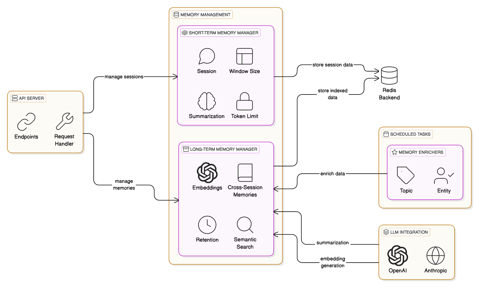

# Redis Agent Memory Server

Agent Memory Server is a high-performance and flexible server for managing
short-term and long-term memory for agents using Redis. It provides both REST
API endpoints and an MCP (Model Context Protocol) server interface for robust
memory operations in AI applications.

## Features

- **Short-Term Memory**
  - Storage for messages, token count, context, and metadata for a session
  - Automatically and recursively summarizes conversations
  - Token limit management based on specific model capabilities

- **Long-Term Memory**
  - Storage for long-term memories across sessions
  - Semantic search to retrieve memories, with filters such as topic, entity, etc.
  - Automatic topic modeling for stored memories with BERTopic
  - Automatic Entity Recognition using BERT

- **Other Features**
  - Support for OpenAI and Anthropic model providers
  - Namespace support for session and long-term memory isolation
  - Both a REST interface and MCP server

## System Diagram


## Roadmap
- Long-term memory deduplication
- Configurable strategy for moving session memory to long-term memory
- Auth hooks
- Use a background task system instead of `BackgroundTask`

## REST API Endpoints

The following endpoints are available:

- **GET /health**
  A simple health check endpoint returning the current server time.
  Example Response:
  ```json
  {"now": 1616173200}
  ```

- **GET /sessions/**
  Retrieves a paginated list of session IDs.
  _Query Parameters:_
  - `page` (int): Page number (default: 1)
  - `size` (int): Number of sessions per page (default: 10)
  - `namespace` (string, optional): Filter sessions by namespace.

- **GET /sessions/{session_id}/memory**
  Retrieves conversation memory for a session, including messages and
  summarized older messages.

- **POST /sessions/{session_id}/memory**
  Adds messages (and optional context) to a session's memory.
  _Request Body Example:_
  ```json
  {
    "messages": [
      {"role": "user", "content": "Hello"},
      {"role": "assistant", "content": "Hi there"}
    ]
  }
  ```

- **DELETE /sessions/{session_id}/memory**
  Deletes all stored memory (messages, context, token count) for a session.

- **POST /sessions/{session_id}/search**
  Performs a semantic search on the messages within a session.
  _Request Body Example:_
  ```json
  {
    "text": "Search query text"
  }
  ```

## MCP Server Interface
Agent Memory Server offers an MCP (Model Context Protocol) server interface powered by FastMCP, providing tool-based long-term memory management:

- **create_long_term_memories**: Store long-term memories.
- **search_memory**: Perform semantic search across long-term memories.
- **memory_prompt**: Generate prompts enriched with session context and long-term memories.

## Getting Started

### Local Install

1. Install the package and required dependencies:
   ```bash
   pip install -e .
   ```

2. Start both the REST API server and MCP server:
  ```bash
  python -m redis_memory_server.main
  ```

### Docker Compose

To start the API using Docker Compose, follow these steps:

1. Ensure that Docker and Docker Compose are installed on your system.

2. Open a terminal in the project root directory (where the docker-compose.yml file is located).

3. (Optional) Set up your environment variables (such as OPENAI_API_KEY and ANTHROPIC_API_KEY) either in a .env file or by modifying the docker-compose.yml as needed.

4. Build and start the containers by running:
   docker-compose up --build

5. Once the containers are up, the API will be available at http://localhost:8000. You can also access the interactive API documentation at http://localhost:8000/docs.

6. To stop the containers, press Ctrl+C in the terminal and then run:
   docker-compose down

## Configuration

You can configure the service using environment variables:

| Variable | Description | Default |
|----------|-------------|---------|
| `REDIS_URL` | URL for Redis connection | `redis://localhost:6379` |
| `LONG_TERM_MEMORY` | Enable/disable long-term memory | `True` |
| `WINDOW_SIZE` | Maximum messages in short-term memory | `20` |
| `OPENAI_API_KEY` | API key for OpenAI | - |
| `ANTHROPIC_API_KEY` | API key for Anthropic | - |
| `GENERATION_MODEL` | Model for text generation | `gpt-4o-mini` |
| `EMBEDDING_MODEL` | Model for text embeddings | `text-embedding-3-small` |
| `PORT` | Server port | `8000` |
| `TOPIC_MODEL` | BERTopic model for topic extraction | `MaartenGr/BERTopic_Wikipedia` |
| `NER_MODEL` | BERT model for NER | `dbmdz/bert-large-cased-finetuned-conll03-english` |
| `ENABLE_TOPIC_EXTRACTION` | Enable/disable topic extraction | `True` |
| `ENABLE_NER` | Enable/disable named entity recognition | `True` |


## Development

### Installation

1. Install dependencies:
```bash
pip install -e ".[dev]"
```

2. Set up environment variables (see Configuration section)

3. Run the server:
```bash
python -m redis_memory_server.main
```

### Running Tests
```bash
python -m pytest
```

### Contributing
1. Fork the repository
2. Create a feature branch
3. Commit your changes
4. Push to the branch
5. Create a Pull Request

## License

This project derives from original work from the Motorhead project:
https://github.com/getmetal/motorhead/

The original code is licensed under the Apache License 2.0:
https://www.apache.org/licenses/LICENSE-2.0

Modifications made by Redis, Inc. are also licensed under the Apache License 2.0.
