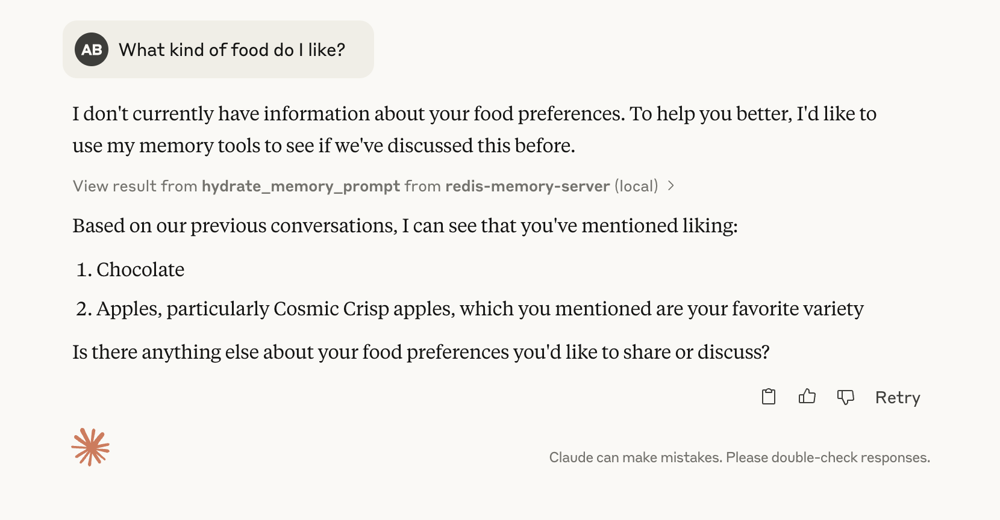
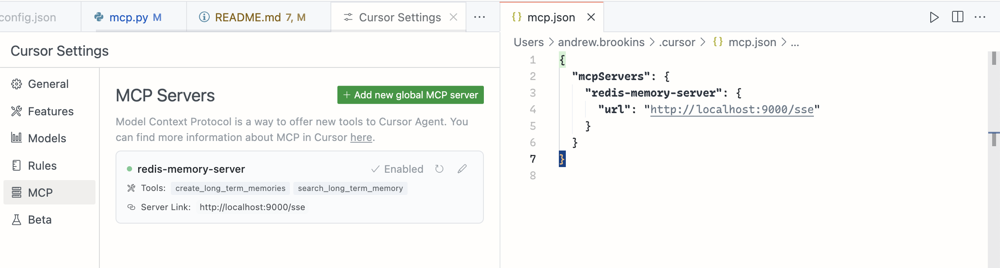

# MCP Server Interface

Agent Memory Server offers an MCP (Model Context Protocol) server interface powered by FastMCP, providing tool-based memory management for LLMs and agents:

- **set_working_memory**: Set working memory for a session (like PUT /sessions/{id}/memory API). Stores structured memory records and JSON data in working memory with automatic promotion to long-term storage.
- **create_long_term_memories**: Create long-term memories directly, bypassing working memory. Useful for bulk memory creation.
- **search_long_term_memory**: Perform semantic search across long-term memories with advanced filtering options.
- **memory_prompt**: Generate prompts enriched with session context and long-term memories. Essential for retrieving relevant context before answering questions.

## Using the MCP Server with Claude Desktop, Cursor, etc.

You can use the MCP server that comes with this project in any application or SDK that supports MCP tools.

### Claude



For example, with Claude, use the following configuration:

```json
{
  "mcpServers": {
    "redis-memory-server": {
      "command": "uv",
      "args": [
        "--directory",
        "/ABSOLUTE/PATH/TO/REPO/DIRECTORY/agent-memory-server",
        "run",
        "agent-memory",
        "-mcp",
        "--mode",
        "stdio"
      ]
    }
  }
}
```

**NOTE:** On a Mac, this configuration requires that you use `brew install uv` to install uv. Probably any method that makes the `uv`
command globally accessible, so Claude can find it, would work.

### Cursor



Cursor's MCP config is similar to Claude's, but it also supports SSE servers, so you can run the server in SSE mode and pass in the URL:

```json
{
  "mcpServers": {
    "redis-memory-server": {
      "url": "http://localhost:9000/sse"
    }
  }
}
```
